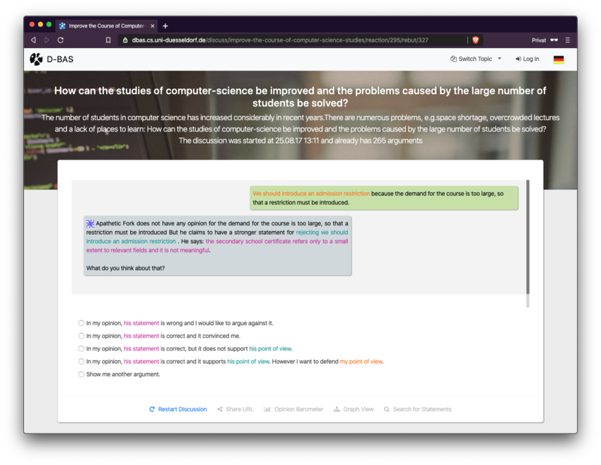

# D-BAS


D-BAS is a novel approach to online
argumentation. It avoids the pitfalls of unstructured systems such as asynchronous threaded discussions and it is
usable by any participant without training while still supporting the full complexity  of real-world argumentation.
The key idea is to let users exchange arguments  with each other in the form of a time-shifted dialog where arguments
are presented and acted upon one-at-a-time.

Currently, the main development-process happens in our GitLab instance, but you
can open issues here, submit pull requests etc. and we will coordinate your
contributions.

You can play around with the latest release of D-BAS on [https://dbas.cs.hhu.de/](https://dbas.cs.hhu.de).



## Setup for Linux / macOS

Ensure that the following tools are installed:

* Python >= 3.6
* [Docker](https://docs.docker.com/engine/installation/)
* [Docker Compose](https://docs.docker.com/compose/install/)

## Documentation

Find the latest documentation here: https://dbas.cs.hhu.de/docs/

## Environment Variables
D-BAS needs some environment variables to be set for running properly.
By default those variables which are required by D-BAS are stored in `.env`.
To get further details on which variables are set or how they can be added/changed take a look at the documentation [here](https://dbas.cs.uni-duesseldorf.de/docs/installation.html).

## Run D-BAS

Then follow these steps:

    docker-compose up

If you want to include the notification service as well as elastic search:

    docker-compose -f docker-compose.yml -f docker-compose.notifications.yml -f docker-compose.search.yml up

Production mode:

    docker-compose -f docker-compose.production.yml up --build

After this you can hit [http://localhost:4284](http://localhost:4284) for D-BAS.

If your container stucks during the first start up, please install D-BAS manually (while the container is running) via:

    docker-compose exec web make

Afterwards everything should be fine.

## Maintainers

* [Christian Meter](mailto:meter@hhu.de)
* [Björn Ebbinghaus](mailto:bjoern.ebbinghaus@hhu.de)

### Contributors

We thank all contributors of this project! In order of appearance:

* Alexander Schneider
* Marc Feger
* Markus Brenneis
* Jan Steimann

### Former Contributors

Thanks to all former contributors! In order of appearance:

* Teresa Uebber (JS Graphs and Visualizations)

### Former Maintainers

Thanks for maintaining the project and for your work! We appreciate your efforts :tada: In order of appearance:

* [Tobias Schröder (né Krauthoff)](mailto:tobias.krauthoff@hhu.de)

## Scientific Background

We published several papers on this work and on our software. Here is a selection of them:

* [Various Efforts of Enhancing Real World Online Discussions](https://wwwcn.cs.uni-duesseldorf.de/publications/publications/library/SchneiderMeter2019a.pdf)
* [D-BAS - A Dialog-Based Online Argumentation System](https://wwwcn.cs.uni-duesseldorf.de/publications/publications/library/Krauthoff2018b.pdf)
* [Overview of our Publications](https://www.cn.hhu.de/unser-team/team/meter/personal-publications.html)

### Citations

Cite this software with the BibTeX Scheme:

```
@inproceedings{hhucn2018,
  title={D-BAS-A Dialog-Based Online Argumentation System.},
  author={Krauthoff, Tobias and Meter, Christian and Baurmann, Michael and Betz, Gregor and Mauve, Martin},
  booktitle={COMMA},
  pages={325--336},
  year={2018}
}
```

## License

Copyright (c) 2016 - 2018 Tobias Schröder (né Krauthoff), Christian Meter  
Copyright (c) 2018 - today hhucn

Distributed under the [MIT License](LICENSE).
