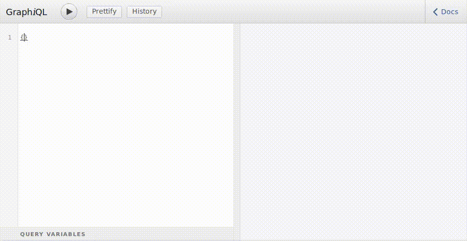

=====
APIv2
=====

Whilst APIv1 main goal was to make D-BAS' discussion-routes accessible from a
remote service, version 2 tries to be more precise and more concise to provide a
much cleaner experience.

This API uses OpenAPI and is described `in this specification
<https://app.swaggerhub.com/apis/MrOerni/D-BAS/1.0.0>`_, which is currently a
work-in-progess.

GraphQL
=======

First of all we added support for `Facebook's GraphQL <http://graphql.org/>`_,
because many typical routes can be left out, since the query-language allows to
request nearly all the objects we need. This is interesting for most of the
theoretical scientists, since they typically want some specific data and are now
able to query them without having a special route in the code.

We chose the typical entry-route ``/api/v2/query?q=`` for GraphQL. Therefore,
this is the route where you should add your GET-Parameters to query data from
D-BAS' database.

.. note::

   Not all fields are queryable. Only those fields, which seem to be interesting
   for the public in our opinion, are accessible. If you need more fields,
   please contact us. Also only not-disabled entities are exposed.

GraphiQL
--------

For easy-access to our data, we added `GraphiQL
<https://github.com/graphql/graphiql>`_, which offers an IDE-like experience
when building queries to our GraphQL API. Here is a sample query and some
keybindings, which are commonly used when using GraphiQL:

Access our GraphiQL at `https://dbas.cs.uni-duesseldorf.de/graphiql
<https://dbas.cs.uni-duesseldorf.de/graphiql/graphiql>`_ or
`http://localhost:4284/graphiql <http://localhost:4284/graphiql>`_.

Examples
--------

Queries can be written as::

  query {
    issues {
      uid
    }
  }

which queries all accessible issues from the database and returns their IDs. You
can query it directly from your browser:

`https://dbas.cs.uni-duesseldorf.de/api/v2/query?q=query{issues{uid}}
<https://dbas.cs.uni-duesseldorf.de/api/v2/query?q=query{issues{uid}}>`_

The resulting response is a JSON-object::

  {"issues": [{"uid": "2"}, {"uid": "3"}, {"uid": "4"}, {"uid": "5"}, {"uid": "7"}]}

Issue with uid: 1 is not available, because it was disabled.

In Clojure a query looks like this::

  (client/get "https://dbas.cs.uni-duesseldorf.de/api/v2/query"
              {:query-params {"q" "query { issues { uid }}"}})

If you want to query the title and the uid, you can just extend the query to this::

  query {
    issues {
      uid,
      title
    }
  }

Query it like this: `/api/v2/query?q=query{issues{uid,title}}
<https://dbas.cs.uni-duesseldorf.de/api/v2/query?q=query{issues{uid,title}}>`_
and get the result::

  {
    "issues": [{
      "uid": "1",
      "title": "Verbesserung des Informatik-Studiengangs"
    }, {
      "uid": "2",
      "title": "Town has to cut spending"
    }, {
      "uid": "3",
      "title": "Improvements of D-BAS"
    }, {
      "uid": "4",
      "title": "Improve the Course of Computer-Science Studies"
    }]
  }

Query specific entities
"""""""""""""""""""""""

A common scenario is to query entities by one or more of their fields, e.g. the
uid, slug or similar. We can query entities commonly by the primary keys and by
those fields, which appear to be interesting to us. If you need more, please
contact us or provide a `pull request <https://github.com/hhucn/dbas>`_.

You can add parameters to a query::

  query {
    issue (uid: 2) {
      title
    }
  }

URL: `/api/v2/query?q=query{issue(uid:2){title}}
<https://dbas.cs.uni-duesseldorf.de/api/v2/query?q=query{issue(uid:2){title}}>`_

Result::

  {
    "issue": {
      "title": "Town has to cut spending"
    }
  }

.. note::

   We query "issue" and no longer "issues". We try to use the singular-form for
   a single entity and the plural forms should always return a list containing
   all matching entities.

Commonly, unique identifier of an entity are queryable by GraphQL::

  query {
    issue (slug: "town-has-to-cut-spending") {
      uid
    }
  }

URL: `/api/v2/query?q=query{issue(slug:"town-has-to-cut-spending"){uid}}
<https://dbas.cs.uni-duesseldorf.de/api/v2/query?q=query{issue(slug:"town-has-to-cut-spending"){uid}}>`_

Result::

  {
    "issue": {
      "uid": "2"
    }
  }

Nested queries
""""""""""""""

It is possible to query specific elements from the database by their id::

  query {
    statement (uid: 42) {
      uid
    }
  }

As a URL: `/api/v2/query?q=query{statement(uid:42){uid}} <https://dbas.cs.uni-duesseldorf.de/api/v2/query?q=query{statement(uid:42){uid}}>`_

This will give you a pretty senseless response::

  {
    "statement": {
      "uid": "42"
    }
  }

But we might be interested in the textversions, which are referenced via
foreign_key. To resolve the textversion of this statement (i.e. get the String,
which is the human-readable form of the statement), we can extend this query::

  query {
    statement (uid: 42) {
      uid
      textversions {
        content
      }
    }
  }

In a URL: `/api/v2/query?q=query{statement(uid:42){uid,textversions{content}}} <https://dbas.cs.uni-duesseldorf.de/api/v2/query?q=query{statement(uid:42){uid,textversions{content}}}>`_

Which results in this response::

  {
    "statement": {
      "uid": "42",
      "textversions": {
        "content": "we should increase the revenues of our towns"
      }
    }
  }

That's awesome! We have nested queries with exactly the data we wanted to have.

Another example::

  query {
    issue (slug: "town-has-to-cut-spending") {
      uid
      users {
        publicNickname
      }
    }
  }

That's too much to type the URL by hand. But it's very easy with the programming
language of your choice. Here again in Clojure::

  (client/get "https://dbas.cs.uni-duesseldorf.de/api/v2/query"
              {:query-params {"q" "query {
                                     issue (slug: \"town-has-to-cut-spending\") {
                                       uid
                                       users {
                                         publicNickname
                                       }
                                     }
                                   }"}})

Results in::

  {"issue": {"uid": "2", "users": {"publicNickname": "Tobias"}}}

More examples
"""""""""""""

There are more examples in the test-sections of GraphQL. Just browse the code
`api/v2/graphql/tests
<https://github.com/hhucn/dbas/tree/master/api/v2/graphql/tests>`_ to find them.

Source-Code Docstrings
======================

Module
------

.. automodule:: api.v2
    :members:

Views
-----

.. automodule:: api.v2.views
    :members:

GraphQL
-------

.. automodule:: api.v2.graphql.core
    :members:
