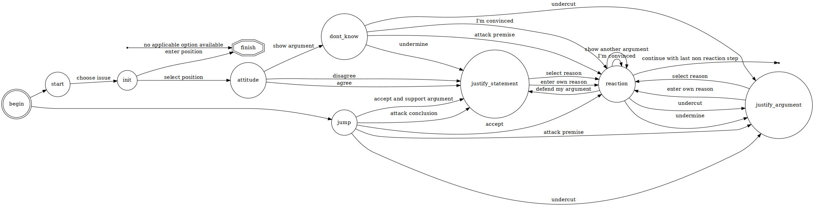

=====
D-BAS State Machine
=====

The following image shows D-BAS as a state machine. Every transition needs paremeters
that are either derived from the current state or taken from the discussions database.
The explanation below the state machine documents how those look.

States and Transitions
=======

lorem ipsum

Special States
--------

lorem ipsum
